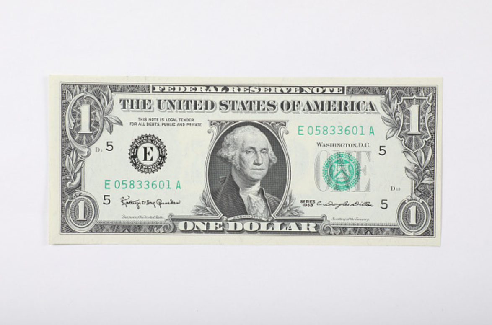
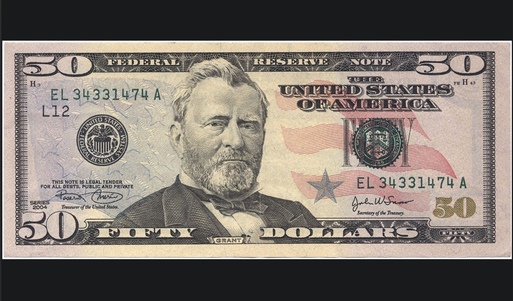

Dataset from:
https://www.kaggle.com/datasets/aishwaryatechie/usd-bill-classification-dataset

## 1 Dollar Image

## Result 
```
Predicted amount: $1 bill (Dollar)  [class='1 Dollar'] (p=0.9992)

Top candidates:
  $1 bill (Dollar)  [class='1 Dollar']: 0.9992
  $50 bill (Dollar)  [class='50 Dollar']: 0.0004
  $2 bill (Doolar)  [class='2 Doolar']: 0.0003
```
## 50 Dollar Image

## Result
```
Predicted amount: $50 bill (Dollar)  [class='50 Dollar'] (p=1.0000)

Top candidates:
  $50 bill (Dollar)  [class='50 Dollar']: 1.0000
  $5 bill (Dollar)  [class='5 Dollar']: 0.0000
  $2 bill (Doolar)  [class='2 Doolar']: 0.0000
```
## 100 Dollar Image

## Result
```Predicted amount: $100 bill (Dollar)  [class='100 Dollar'] (p=1.0000)

Top candidates:
  $100 bill (Dollar)  [class='100 Dollar']: 1.0000
  $2 bill (Doolar)  [class='2 Doolar']: 0.0000
  $50 bill (Dollar)  [class='50 Dollar']: 0.0000```